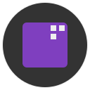
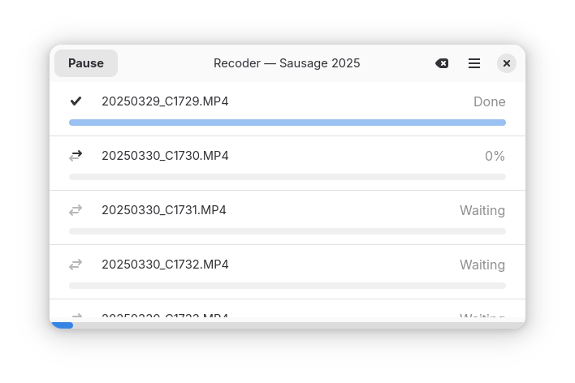

⚠️ This repository has moved to https://git.jeena.net/jeena/recoder

  

# Recoder

*Batch transcode family videos to DNxHD for smooth Davinci Resolve editing*

**Recoder** is a clean and minimal video transcoder for Linux, designed for GNOME using GTK4 and libadwaita. It supports batch processing, drag-and-drop, and a straightforward user experience.

## 📖 Help

See [docs/HELP.md](docs/HELP.md) for usage instructions and tips.

## ✨ Features

See the [Recoder Website](https://jeena.github.io/recoder/) for a full list of features.

## 📦 Installation

Recoder is available in the AUR and as a flatpak. Visit the [Recoder Website](https://jeena.github.io/recoder/) for install instructions.

## 📄 License

Recoder is licensed under the GNU General Public License v3.0.  
See [LICENSE](LICENSE) for details.
