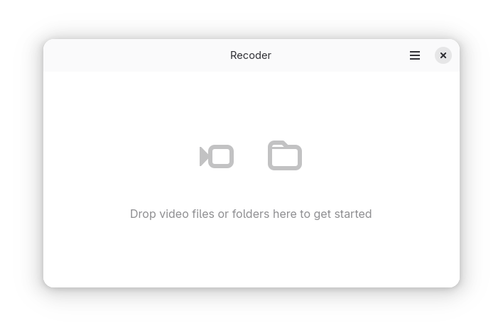
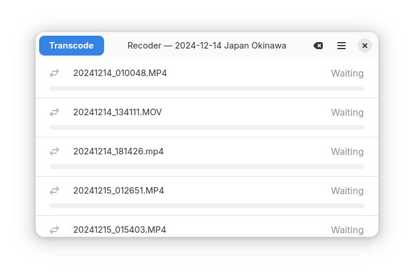
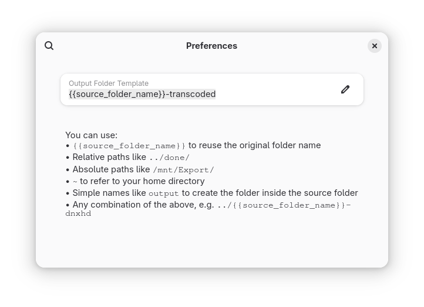

  

# Recoder — Help Guide

Recoder is a minimal, user-friendly tool for batch video transcoding. This quick guide walks you through using the app.

---

## 🚀 Getting Started

When you open Recoder, you’ll see a prompt inviting you to drop a video file or folder:

### 📂 Dropping Files or Folders

- You can drop **one video file** or **one folder** containing video files onto the app.
- The folder can have subdirectories, but Recoder will **not** process files recursively. Only files in the dropped folder itself will be processed.
- Non-video files will be ignored.

### 🔧 Preparing to Transcode

After you drop a folder into Recoder, it will list all the video files it found:

- A blue **Transcode** button appears once the files are ready to process.
- The **Clear icon** is always available — click it to cancel everything and reset the app if you're done or need to start over.
- The **menu button** gives access to Preferences and Help.

---

## 🎬 Transcoding

Click the Transcode button to start processing. While transcoding:

- The blue **Transcode** button is replaced by a **Pause** button, allowing you to temporarily stop the process.
- If paused, the button changes to **Resume**, so you can continue when you're ready.
- The **Clear button** can also be used during transcoding to cancel the process entirely and clear the current session.

By default:

- Transcoded files are saved into the same directory as the source, inside a subfolder named `{{source_folder_name}}-transcoded`.
- File names remain the same as the originals but with a `.mov` extension.

---

### ⚙️ Preferences

In Preferences, you can customize the single **output folder path** where transcoded files will be saved. This path controls both the folder’s location and name. You can use:

- `{{source_folder_name}}` to reuse the original folder name
- Relative paths like `../done/`
- Absolute paths like `/mnt/Export/`
- `~` to refer to your home directory
- Simple names like `output` to create a folder inside the source folder
- Any combination of the above, e.g. `../{{source_folder_name}}-dnxhd`

---

## 💡 Notes

- Make sure you have enough free space on your drive because both the original and transcoded files are kept, and transcoded files may be larger.

---

If you need more help, check the [GitHub repository](https://github.com/jeena/recoder) or open an issue.